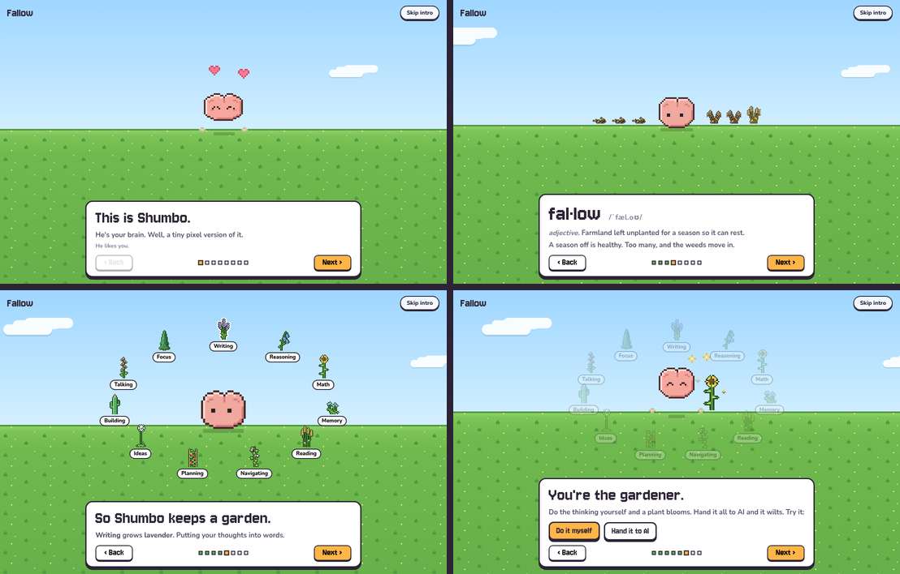

# Fallow

A garden for the thinking you hand to AI.

Every skill is a plant: writing is lavender, memory is forget-me-nots, ideas are a dandelion. Doing the work yourself waters a plant; handing it to an AI doesn't, and left alone it wilts on the same curve memory follows. Shumbo, a brain pet, lives in the garden and reads your numbers: he thrives, holds steady, fades or goes fallow with them. Before you send an ask, he says whether this one is worth trying yourself.


Fields left unworked go fallow. So do skills.

## Why

The evidence behind the design, in one paragraph. Handing an AI the answer hurts unassisted performance while scaffolded help does not ([Bastani et al. 2025, PNAS](https://doi.org/10.1073/pnas.2422633122); [Anthropic 2026](https://www.anthropic.com/research/AI-assistance-coding-skills)). Expert skill drifts within months of assistance ([Budzyń et al. 2025](https://wrap.warwick.ac.uk/id/eprint/191005)). People cannot feel it: developers who were 19% slower with AI believed they were 20% faster ([METR 2025](https://metr.org/blog/2025-07-10-early-2025-ai-experienced-os-dev-study/)). Skill decay is lawful and domain-specific ([Arthur et al. 1998](https://doi.org/10.1207/s15327043hup1101_3)), which is what spaced repetition already models ([FSRS](https://github.com/open-spaced-repetition/awesome-fsrs/wiki/The-Algorithm)). The one earlier offload with clean evidence of harm is GPS, and it hits the navigation system that Alzheimer's disease reaches first ([Dahmani and Bohbot 2020](https://doi.org/10.1038/s41598-020-62877-0); [Coughlan et al. 2019](https://doi.org/10.1073/pnas.1901600116)). Push-back works when it comes before the answer and scaffolds instead of recommending ([Buçinca et al. 2021](https://arxiv.org/abs/2102.09692); [Gajos and Mamykina 2022](https://arxiv.org/abs/2202.05402)). Daily capacity is sleep pressure plus circadian phase, modeled for aviation crews ([Åkerstedt and Folkard 1997](https://pubmed.ncbi.nlm.nih.gov/9095372/); [Ingre et al. 2014](https://doi.org/10.1371/journal.pone.0108679)); there is no daily willpower tank ([Vohs et al. 2021](https://doi.org/10.1177/0956797621989733)) and dopamine does not drain like a battery.

## Live site

**https://fallow-omega.vercel.app** (mirror: https://shourya0mehta.github.io/fallow/)

The hosted version is the whole app with no server of its own. A first visit opens with *Meet Shumbo*, an eight-step walkthrough: who he is, what fallow means, the eleven plants in a ring around him, a plant to water yourself, and then the plants fly down into a fresh garden of seedlings (or a demo one, if you'd rather look around first). The demo is ninety days of everyday sample asks, one bank per plant in `src/data/demo-asks.ts`, re-dated so it always ends today in the visitor's own time zone; anything they log on it is kept apart and comes along when they start their own garden or sign in. The ledger lives in the visitor's own browser (IndexedDB), the ask bar and practice sessions run the core in the page, and importing a ChatGPT or Claude export never uploads the file. Signing in with Google is optional and keeps the garden on every device ([Sign in and sync](#sign-in-and-sync)). The demo chat page shows the extension's verdict card without the extension installed.



Build it with `npm run build:static` (static files in `out/`). Both hosts rebuild on every push to `main`:

- **Vercel**: import the repo, framework preset **Other**, build command `npm run build:static`, output directory `out`, environment variable `NEXT_PUBLIC_REPO_URL` set to the repo URL. Leave `NEXT_PUBLIC_BASE_PATH` unset so the site is served from the root.
- **GitHub Pages**: Settings, Pages, Source: **GitHub Actions**. The workflow in `.github/workflows/pages.yml` runs the tests and the typecheck, builds the static site under the `/fallow` base path, and deploys it to `https://<your-user>.github.io/fallow/`. For a custom domain, set the repository variable `PAGES_BASE_PATH` to `/` and add a `CNAME` file in `public/`.

Same codebase, two builds: `next build` gives the local app with its API, file-backed ledger, hooks and extension; `STATIC_EXPORT=1` gives the hosted site. The pages detect which one they are running in.

## Quick start

```bash
npm install
npm run seed      # 90 days of sample asks, for a first look
npm run dev       # http://localhost:3000
```

Then either import your own history (Journal: drop the `conversations.json` from a ChatGPT or Claude data export; parsing happens in the browser), load the browser extension so ChatGPT, Claude and Gemini asks are filed as you type them, or wire the Claude Code hook so every prompt in the terminal is filed too.

The local app keeps everything in one file, `data/fallow.json`. No accounts, no cloud; sign-in sync is a hosted-site feature. `npm run demo` runs a read-only demo ledger (`FALLOW_DEMO=1`) that can be deployed anywhere Next.js runs.

## The four places

| Place | What it does |
| --- | --- |
| Garden | The whole daily loop on one screen. Eleven plants, one per skill, sway when fresh, wilt and drop leaves when fading, stand dry when stale, and leave cracked soil when fallow. A brand-new garden starts as eleven seedlings. Click a plant for its card: freshness, last time you did it yourself, twelve weeks of you vs AI, and a "water it" session. Shumbo hops, spins, gets petted, gets dizzy, sleeps through your sleep window and follows your cursor. Under him, the ask bar: paste what you were about to ask an AI and he answers in his speech bubble (do it yourself, scaffold, co-pilot or delegate). Below: Today (energy, own work, screens, focus) and Quests (the thirstiest plants, each a button that starts a session). |
| Journal | Every ask, filed under its plant, filterable by plant and by who did it. Import a ChatGPT or Claude export here (drag and drop; parsed in the browser). |
| Settings | The keep list as plant tiles, push-back intensity, sleep and chronotype, the sites the extension pauses you on, Google sign-in and text sync, export and erase. Saves as you go. |
| How it works | The loop in four pictures, Shumbo's formula, where the data comes from, what Fallow does not claim, the research behind each mechanism, and a replay of the intro. |

Old links (`/gate`, `/practice`, `/ledger`, `/import`, `/day`, `/about`, `/evidence`) redirect to their new homes. `/?intro=1` replays the intro.

## Sign in and sync

Optional, free and local-first. The garden works signed out; signing in with Google keeps it on every device.

- **Stack.** Firebase Authentication (Google provider) and Cloud Firestore, both on the free Spark plan. No server code: the browser talks to Firestore directly, and the security rules in `firestore.rules` let each account read and write only its own `users/{uid}` tree. The Firebase SDK loads on demand, so a visitor who never signs in downloads none of it.
- **Data model.** One document per person for settings and one per month of asks: `users/{uid}/months/{YYYY-MM}` holds `events`, `signals` and `deleted` maps keyed by stable event ids. An ask is about 180 bytes, so even a busy month is a few dozen kilobytes.
- **Merge.** IndexedDB stays the source of truth on each device. On sign-in, page load, tab focus and reconnect, the client pulls the account, merges by id (both sides' asks, deletions win, newer settings win) and pushes what the account is missing. New asks go up within a second. Asks logged while offline wait and go up later. The demo's sample asks are never uploaded: signing in on the demo swaps it for your garden and brings along only the asks you logged yourself.
- **Privacy.** Only plant tags, times, who did the work, and settings leave the device. The words you typed stay where you typed them unless you turn on *Also sync the text of my asks* in Settings; turning it off rewrites the account without them. Erase clears both copies.
- **Cost.** Zero. A full sync reads one document per month of history and each batch of new asks is one write. The free tier (1 GiB stored, 50,000 reads and 20,000 writes a day, 50,000 monthly active users for sign-in) covers on the order of a thousand people syncing every day, and if a daily quota ever runs out, sync pauses until it resets while the garden keeps working on the device.

The pure merge is `src/core/sync.ts` (unit tested); the engine, the Firestore store and Google sign-in are `src/client/sync.ts`, `remote.ts` and `account.ts`. `npm run test:sync` runs two devices against the Firebase emulators: uploads, the demo swap, deletes in both directions, settings, text sync on and off, the rules keeping a second account out, and erase.

**A fork with its own Firebase project:** create a project on the Spark plan, turn on the Google sign-in provider, add your site's domain under Authentication settings, create a Firestore database, publish the rules with `npm run deploy:rules`, and paste the web app config into `src/client/firebase-config.ts`. That config is public by design; the rules are what protect the data. Build with `NEXT_PUBLIC_FALLOW_SYNC=0` to leave sign-in out.

## The models

**Taxonomy.** Eleven domains anchored to Cattell-Horn-Carroll broad abilities and O\*NET cognitive abilities: composition, analytical reasoning, quantitative reasoning, recall, reading and synthesis, spatial navigation, planning, creative ideation, implementation, verbal expression, sustained attention. Each carries a decay class from Arthur et al.'s task categories and a group-average fMRI note that is worded as engagement, never training, because reverse inference from region to process is weak ([Poldrack 2006](https://doi.org/10.1016/j.tics.2005.12.004)). `src/core/taxonomy.ts`.

**Classifier.** A transparent lexicon classifier: prompt text to domains (up to three, weighted), ask type (answer, hint, review, explain, other) and ICAP engagement level (passive, active, constructive, interactive, after [Chi and Wylie 2014](https://doi.org/10.1080/00461520.2014.965823)). It returns the terms that drove the decision. Asking for the finished thing is delegation; bringing an attempt, asking for a hint, a review or an explanation is shared work. An LLM classifier can implement the same interface. `src/core/classify.ts`.

**Scheduler.** Each domain is a flashcard. Retrievability follows the FSRS power law over a stability S (days at which R falls to 0.9):

```
R(t, S) = (1 + f · t / S)^(-w),   f = 0.9^(-1/w) - 1,   w = 0.5
```

Self-done work is a review: S grows, and grows more when R was low at the time (the desirable-difficulty result written into the math) and more for higher ICAP levels. Delegated work is not a review. Statuses: fresh at R ≥ 0.85, fading to 0.70, stale to 0.55, fallow below or never practiced. Stability priors by decay class: 14, 30 and 60 days. Priors, not measurements. `src/core/scheduler.ts`.

**Budget.** The three-process model of alertness with the published constants:

```
S_wake(t)  = 2.4 + (S_w - 2.4) · e^(-0.0353 t)
S_sleep(t) = 14.3 - (14.3 - S_s) · e^(-0.381 t)
C(t)       = 2.5 · cos(2π (t - 16.8) / 24)      shifted by chronotype
U(t)       = 0.5 · cos(2π t / 12) - 0.5
W(t)       = -5.72 · e^(-1.51 t)                  sleep inertia
Alertness  = S + C + U + W,    KSS ≈ 9.68 - 0.46 · Alertness
```

plus a fatigue term F, a leaky integrator over minutes of demanding work (saturating near six hours, recovering with a two-hour time constant), after [Wiehler et al. 2022](https://doi.org/10.1016/j.cub.2022.07.010). Capacity = (alertness − 1)/15 × (1 − 0.35 F). The fatigue term and the 0.35 are hypotheses and are labelled as such in the UI. `src/core/alertness.ts`.

**Policy.** Four engagement modes.

| Mode | The model | Picked when |
| --- | --- | --- |
| Do it yourself | Offers a 15-minute timer and one first step; withholds the artifact | Domain is stale, task is conceptual, domain is on the keep list, capacity is available |
| Scaffold | Hints, questions and structure; withholds the answer | Domain is stale or middling and the task carries learning value; any hint request; any explanation request that would otherwise be refused |
| Co-pilot | Drafts, then requires explain-it-back, three edits, or a checklist before acceptance | Domain is fresh, capacity is low, or the deadline is real; any review of the person's own work |
| Delegate | Does the task, logs it, flags idea origin | Rote work, a domain off the keep list, acute time pressure |

Intensity (gentle, standard, firm) sets the thresholds, because the forcing functions that work best are the ones people rate lowest. `src/core/policy.ts`.

## The look

"Meadow day": white cards with chunky ink outlines on a sky-to-meadow background that follows the real time of day (dawn, day, dusk, night). [Jersey 10](https://fonts.google.com/specimen/Jersey+10) for display and numbers, [Nunito](https://fonts.google.com/specimen/Nunito) for reading, both OFL and bundled. Live data gets a pulsing dot. Buttons press down. Reduced-motion settings are respected everywhere.


**Pixel art as code.** Nothing in the garden is an image file. `src/pixel/` draws everything into small grids at runtime: `plants.ts` (eleven species, each in four conditions), `creature.ts` (Shumbo as a rig that squashes, stretches, blinks, looks around and changes mood), `scene.ts` (sky by time of day, hills, fence, beds, a layout that splits into two beds on phones), `sprites.ts` (sun, moon, clouds, hearts, sparkles, water drops, the watering can, quest markers). `src/components/garden/engine.ts` runs it at 30 fps on one canvas: swaying, particles, fireflies at dusk, Shumbo's state machine and pointer gestures (`gestures.ts`: tap, double click, hold, rub, rapid clicks). `npm run pixel` writes PNG previews; `node scripts/pixel/record.mjs` records the GIF above from the running site. The intro (`src/components/intro/`) reuses the same rig at a larger scale, and its last step flies each plant into its bed with the Web Animations API, handing over to the garden canvas the moment each one lands.

**Shumbo's stage** comes from `src/core/creature.ts`: 70% the mean freshness of the keep list, 20% the share of the last thirty days' asks you did or shared, 10% energy now. Thriving from 0.80, steady from 0.60, fading from 0.40; a rising delegated share on a keep-list skill drops it one stage for the week. A garden with nothing logged yet starts steady, not cracked. The heart chip on the garden opens that breakdown.

## Browser extension

`integrations/browser-extension` is a Manifest V3 extension (Chrome, Edge, Brave, Arc). Load it unpacked from `chrome://extensions` with Developer mode on. It ships the same meadow look and both typefaces (`fallow-font.css`, served from the extension itself), so the card and the pause match the site on every host page. It does two things.

**Chat intercept.** On chatgpt.com, claude.ai and gemini.google.com it catches the send action, asks the local app for a verdict, and shows a card before the prompt leaves: do it yourself, scaffold or co-pilot, with the reasons and the scaffold. Three buttons: *I'll try first* (cancels the send and starts a 15-minute timer badge; when it ends you log "did it" or ask for a hint), *Send with scaffold* (appends the scaffold instruction to your prompt so the model follows it, logged as shared work), *Send anyway* (logged as delegated). Delegate verdicts show a two-second toast and pass straight through. A "quiet on this site for an hour" link exists because the forcing functions that work are the ones people like least. If the app is not running, everything passes through untouched.


**The pause.** On the sites you list in Settings, a full-page breath before the page loads: a countdown you set (10 seconds by default), how many times you have opened one of these today, and your minutes against your own budget when ActivityWatch is syncing. *Not now* closes the tab, *Continue* unlocks after the countdown and snoozes that site for 30 minutes. Each pause is logged, so the board shows your close rate. This is the one screen-time intervention with clean field evidence ([Grüning et al. 2023, PNAS](https://doi.org/10.1073/pnas.2213114120): about a third of attempts abandoned, openings down 57% after six weeks). The budget is a number you see, never a lock; locks work for a few weeks and then get removed.

**Standalone.** The extension does not need the app. When nothing answers at the app's address (or when "Standalone" is ticked in its options), the bundled core (`core.js`, built from `src/core` by `npm run build:extension`) classifies and decides inside the extension and keeps the ledger in `chrome.storage`. The options page shows which mode it is in, exports that ledger as JSON, and the hosted site's Journal imports that file, so a person can install the extension alone and still see their garden.

Try both without an account at `/demo/chat` and `/demo/feed` (add `localhost` to your site list for the feed). `npm run test:extension` drives the whole thing in headless Chromium against the running app: the card, the three buttons, the short-prompt passthrough, the pause, the snooze, and standalone mode.

## Attention layer (ActivityWatch)

[ActivityWatch](https://activitywatch.net) is an open-source (MPL-2.0) local time tracker with a REST API. With it running, `npm run attention` pulls today's window, AFK and browser-tab events, and posts one attention-day signal (switches per active hour, longest unbroken block, minutes on listed sites, where the day went) plus one sustained-attention practice event per focus block of 25 minutes or more. `npm run attention -- --watch` repeats every five minutes. Browser time is split by tab domain when the ActivityWatch browser extension is installed, otherwise by window title. Brief interruptions of a minute or less that return to the same activity do not break a block. `src/core/attention.ts`, with fixture tests.

Switching rate is reported as behavior, not damage: the media-multitasking literature is small and contested, and the one clean field result is that people resume an interrupted task about 25 minutes later (Mark et al. 2005).

## Claude Code hook

Every prompt you type in Claude Code can be assessed and filed. Add to `~/.claude/settings.json` (see `integrations/claude-code/settings.example.json`):

```json
{
  "hooks": {
    "UserPromptSubmit": [
      { "hooks": [ { "type": "command", "command": "node /ABSOLUTE/PATH/fallow/integrations/claude-code/fallow-hook.mjs", "timeout": 10 } ] }
    ]
  }
}
```

With the app running, the hook posts each prompt to `/api/assess`, logs it, and injects the verdict as context Claude can see:

```
[Fallow] Engagement mode for this request: SCAFFOLD.
Domains: Composition (100%). Ask type: answer. Engagement level requested: passive.
Why: Composition has lain fallow 23 days (retrievability 0.62). Composition is on your keep list.
How to respond: Give hints, questions and structure. Withhold the finished answer. ...
```

It fails open: no server, no output. `FALLOW_NO_EXCERPT=1` logs tags only. `FALLOW_BLOCK_SELF=1` turns a "do it yourself" verdict into a blocked prompt (exit 2) instead of advice. `integrations/cursor` has the same thing for Cursor's `beforeSubmitPrompt` hook, written against the docs and not yet run in a real Cursor session.

## API

| Route | Purpose |
| --- | --- |
| `POST /api/assess` `{ text, deadline? }` | Classification, recommendation, and a plain-text context block |
| `POST /api/events` `{ text, actor?, icap?, minutes?, demanding?, source? }` or `{ events: [...] }` | Log one prompt, or add pre-classified events (deduplicated by id) |
| `GET /api/events`, `DELETE /api/events/:id` | Read or remove entries |
| `GET /api/snapshot` | Everything the garden shows, as JSON |
| `GET/POST /api/signals` | Pause outcomes and attention-day summaries |
| `GET/POST /api/settings` | Keep list, intensity, chronotype, sleep, per-day sleep log, entertainment sites, budget, pause length |
| `POST /api/clear` `{ confirm: "erase" }` | Wipe the ledger |

## Tests

```bash
npm test                # vitest: classifier, scheduler, alertness, policy, importers, attention, summary, creature, garden, sync merge, demo (100 tests)
npm run typecheck
npm run emulators       # Firebase Auth and Firestore emulators (needs Java), in one terminal
npm run test:sync       # then this: three devices, one account, against the emulators (24 checks)
npm run test:extension  # headless Chromium against the running app (needs Chrome, or CHROME_PATH)
npm run build:static    # the hosted site, into out/
npm run build:extension # rebuild core.js inside the extension after changing src/core
npm run pixel           # PNG previews of the plants, scenes and pet from src/pixel
```

## Publishing

`scripts/publish.sh` creates the public GitHub repo and pushes (needs `gh auth login` once); the Pages workflow then publishes the live site. `FALLOW_DEMO=1 next start` is the other way to host a demo: a Node server that serves `src/data/demo.json` read-only with in-memory writes.

## What is built

- The eleven-domain taxonomy with evidence annotations and per-domain practice suggestions.
- The lexicon classifier with ask type and ICAP level, and the actor rule that decides what counts as delegation.
- The FSRS-style scheduler over domains, replayed from the ledger, with drift detection on the delegated share over four trailing weeks.
- The three-process alertness model with chronotype, plus the labelled fatigue hypothesis.
- The four-mode policy with user-set intensity.
- ChatGPT and Claude export importers, run in the browser, deduplicated.
- The browser extension: chat intercept with the verdict card on ChatGPT, Claude and Gemini, the pause on listed sites, a standalone mode with the core bundled in, and an end-to-end test.
- The hosted build: one codebase, a client-side ledger in IndexedDB, demo preload, a demo chat that shows the card without the extension, a How it works page with the research, and a GitHub Pages workflow.
- The attention layer from ActivityWatch: switches per hour, longest block, listed-site minutes, focus blocks logged as practice.
- The Claude Code hook, a Cursor hook, and the assess API they use.
- The garden: eleven plant species in four conditions plus a seedling, Shumbo the brain pet with a mood rig and gestures, a sky that follows the time of day, quests that point at plants, practice sessions that water them, the ask bar that answers in his speech bubble, and one Today panel for energy, own work, screens and focus. All drawn as code.
- Four places (Garden, Journal, Settings, How it works) with redirects from the old pages, demo pages for the extension, local JSON persistence, demo mode, 94 unit tests.
- Meet Shumbo: a first-visit walkthrough that defines fallow, gathers the eleven plants around him, lets you water one, and flies everything down into the real garden.
- Google sign-in and sync on Firebase's free tier: local-first merge with deletions that stick, a document per month, owner-only rules, ask text kept on the device by default, and an emulator test.

## What is not built

- Any measurement of the person. Fallow measures asks, not ability. Whether a "stale" domain predicts a drop on an unassisted task is the first study to run, and nobody has run it.
- Fitted parameters. Stability priors, the fatigue penalty, the pause length and the policy thresholds are borrowed or guessed and are documented as such.
- An LLM classifier. The interface is there; the lexicon will mislabel prompts, so hand-label a couple of hundred of your own before trusting a profile.
- Site selectors that survive redesigns. The extension's composer and send-button selectors for ChatGPT, Claude and Gemini are current as of writing and will need a bump when those apps change their DOM; the demo page always works.
- Sync for the extension and the local app. Sign-in covers the hosted site; the extension's standalone ledger and the local app's file still move into it by export and import.
- A Chrome Web Store listing. The extension loads unpacked today.
- Points, a room, decorations. Shumbo reads the ledger; he does not yet earn anything from it. That layer only makes sense once the stages feel right with real data.
- Firefox packaging, a menubar app, calibration tasks (jsPsych is the open base), SQLite persistence. The Cursor hook has not been run in a real Cursor session.

## What it does not claim

Fallow does not measure your brain, diagnose anything, predict disease, or train regions. The brain notes are group-average imaging results phrased as engagement. Words like risk, detect, screen and Alzheimer's do not appear in the product, on purpose. Prompts are sensitive data: the ledger stays on your machine or in your browser unless you sign in, and even then the words you typed stay put unless you turn on text sync. Excerpts are optional, and the erase button is real, here and in the account.

## License

MIT
