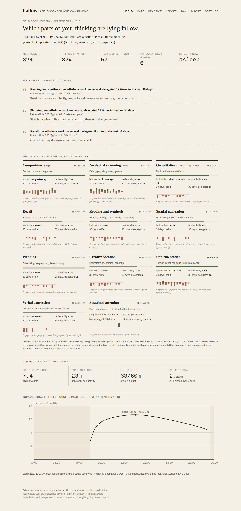
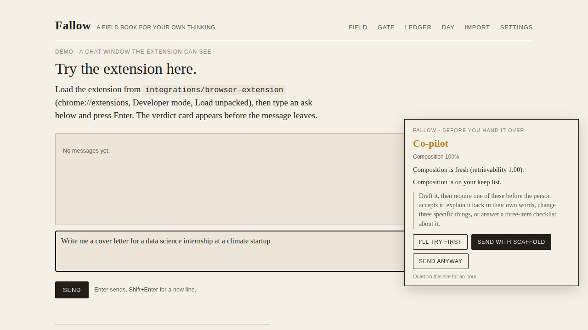

# Fallow

A field book for the thinking you hand to AI.

Fallow keeps a ledger of what you ask AI models to do, files each ask under a cognitive domain, models how each domain decays when you stop doing it yourself, and pushes back at the moment you are about to delegate something that keeps you sharp. It also draws what you have to spend today from a validated alertness model, not from a dopamine myth.



Fields left unworked go fallow. So do skills.

## Why

The evidence behind the design, in one paragraph. Handing an AI the answer hurts unassisted performance while scaffolded help does not ([Bastani et al. 2025, PNAS](https://doi.org/10.1073/pnas.2422633122); [Anthropic 2026](https://www.anthropic.com/research/AI-assistance-coding-skills)). Expert skill drifts within months of assistance ([Budzyń et al. 2025](https://wrap.warwick.ac.uk/id/eprint/191005)). People cannot feel it: developers who were 19% slower with AI believed they were 20% faster ([METR 2025](https://metr.org/blog/2025-07-10-early-2025-ai-experienced-os-dev-study/)). Skill decay is lawful and domain-specific ([Arthur et al. 1998](https://doi.org/10.1207/s15327043hup1101_3)), which is what spaced repetition already models ([FSRS](https://github.com/open-spaced-repetition/awesome-fsrs/wiki/The-Algorithm)). The one earlier offload with clean evidence of harm is GPS, and it hits the navigation system that Alzheimer's disease reaches first ([Dahmani and Bohbot 2020](https://doi.org/10.1038/s41598-020-62877-0); [Coughlan et al. 2019](https://doi.org/10.1073/pnas.1901600116)). Push-back works when it comes before the answer and scaffolds instead of recommending ([Buçinca et al. 2021](https://arxiv.org/abs/2102.09692); [Gajos and Mamykina 2022](https://arxiv.org/abs/2202.05402)). Daily capacity is sleep pressure plus circadian phase, modeled for aviation crews ([Åkerstedt and Folkard 1997](https://pubmed.ncbi.nlm.nih.gov/9095372/); [Ingre et al. 2014](https://doi.org/10.1371/journal.pone.0108679)); there is no daily willpower tank ([Vohs et al. 2021](https://doi.org/10.1177/0956797621989733)) and dopamine does not drain like a battery.

## Quick start

```bash
npm install
npm run seed      # 90 days of a student developer's asks, for a first look
npm run dev       # http://localhost:3000
```

Then either import your own history (Import page: drop the `conversations.json` from a ChatGPT or Claude data export; parsing happens in the browser), load the browser extension so ChatGPT, Claude and Gemini asks are filed as you type them, or wire the Claude Code hook so every prompt in the terminal is filed too.

Everything lives in one file, `data/fallow.json`. No accounts, no cloud. `npm run demo` runs a read-only demo ledger (`FALLOW_DEMO=1`) that can be deployed anywhere Next.js runs.

## The pages

| Page | What it shows |
| --- | --- |
| Field | Eleven cognitive domains as plots: status, retrievability, days since you last did the work yourself, 30-day self vs delegated counts, a twelve-week sparkline. Three nudges: what is worth doing yourself this week. Today's budget curve. |
| Gate | Paste what you were about to ask. Get the domain, the ask type, the engagement level you requested, and a verdict: do it yourself, scaffold, co-pilot, or delegate, with reasons and the exact scaffold a model should follow. Then log what actually happened. |
| Practice | Pick a fallow domain and a length, work a real task without the model, log it. One session roughly doubles a stale domain's stability. |
| Ledger | Every ask, filed, filterable by domain, deletable row by row. |
| Day | The three-process alertness curve for today from your sleep times and chronotype, with capacity, KSS, and the model's components. Plus today's attention numbers: switches per hour, longest unbroken block, minutes on listed sites against your budget, and how the pauses went. |
| Import | ChatGPT and Claude exports, classified locally, deduplicated on re-import. |
| Settings | The keep list, push-back intensity, chronotype, usual sleep, the entertainment site list with its daily budget and pause length, and the erase button. |

## The models

**Taxonomy.** Eleven domains anchored to Cattell-Horn-Carroll broad abilities and O\*NET cognitive abilities: composition, analytical reasoning, quantitative reasoning, recall, reading and synthesis, spatial navigation, planning, creative ideation, implementation, verbal expression, sustained attention. Each carries a decay class from Arthur et al.'s task categories and a group-average fMRI note that is worded as engagement, never training, because reverse inference from region to process is weak ([Poldrack 2006](https://doi.org/10.1016/j.tics.2005.12.004)). `src/core/taxonomy.ts`.

**Classifier.** A transparent lexicon classifier: prompt text to domains (up to three, weighted), ask type (answer, hint, review, explain, other) and ICAP engagement level (passive, active, constructive, interactive, after [Chi and Wylie 2014](https://doi.org/10.1080/00461520.2014.965823)). It returns the terms that drove the decision. Asking for the finished thing is delegation; bringing an attempt, asking for a hint, a review or an explanation is shared work. An LLM classifier can implement the same interface. `src/core/classify.ts`.

**Scheduler.** Each domain is a flashcard. Retrievability follows the FSRS power law over a stability S (days at which R falls to 0.9):

```
R(t, S) = (1 + f · t / S)^(-w),   f = 0.9^(-1/w) - 1,   w = 0.5
```

Self-done work is a review: S grows, and grows more when R was low at the time (the desirable-difficulty result written into the math) and more for higher ICAP levels. Delegated work is not a review. Statuses: fresh at R ≥ 0.85, fading to 0.70, stale to 0.55, fallow below or never practiced. Stability priors by decay class: 14, 30 and 60 days. Priors, not measurements. `src/core/scheduler.ts`.

**Budget.** The three-process model of alertness with the published constants:

```
S_wake(t)  = 2.4 + (S_w - 2.4) · e^(-0.0353 t)
S_sleep(t) = 14.3 - (14.3 - S_s) · e^(-0.381 t)
C(t)       = 2.5 · cos(2π (t - 16.8) / 24)      shifted by chronotype
U(t)       = 0.5 · cos(2π t / 12) - 0.5
W(t)       = -5.72 · e^(-1.51 t)                  sleep inertia
Alertness  = S + C + U + W,    KSS ≈ 9.68 - 0.46 · Alertness
```

plus a fatigue term F, a leaky integrator over minutes of demanding work (saturating near six hours, recovering with a two-hour time constant), after [Wiehler et al. 2022](https://doi.org/10.1016/j.cub.2022.07.010). Capacity = (alertness − 1)/15 × (1 − 0.35 F). The fatigue term and the 0.35 are hypotheses and are labelled as such in the UI. `src/core/alertness.ts`.

**Policy.** Four engagement modes.

| Mode | The model | Picked when |
| --- | --- | --- |
| Do it yourself | Offers a 15-minute timer and one first step; withholds the artifact | Domain is stale, task is conceptual, domain is on the keep list, capacity is available |
| Scaffold | Hints, questions and structure; withholds the answer | Domain is stale or middling and the task carries learning value; any hint request; any explanation request that would otherwise be refused |
| Co-pilot | Drafts, then requires explain-it-back, three edits, or a checklist before acceptance | Domain is fresh, capacity is low, or the deadline is real; any review of the person's own work |
| Delegate | Does the task, logs it, flags idea origin | Rote work, a domain off the keep list, acute time pressure |

Intensity (gentle, standard, firm) sets the thresholds, because the forcing functions that work best are the ones people rate lowest. `src/core/policy.ts`.

## Browser extension

`integrations/browser-extension` is a Manifest V3 extension (Chrome, Edge, Brave, Arc). Load it unpacked from `chrome://extensions` with Developer mode on. It does two things.

**Chat intercept.** On chatgpt.com, claude.ai and gemini.google.com it catches the send action, asks the local app for a verdict, and shows a card before the prompt leaves: do it yourself, scaffold or co-pilot, with the reasons and the scaffold. Three buttons: *I'll try first* (cancels the send and starts a 15-minute timer badge; when it ends you log "did it" or ask for a hint), *Send with scaffold* (appends the scaffold instruction to your prompt so the model follows it, logged as shared work), *Send anyway* (logged as delegated). Delegate verdicts show a two-second toast and pass straight through. A "quiet on this site for an hour" link exists because the forcing functions that work are the ones people like least. If the app is not running, everything passes through untouched.



**The pause.** On the sites you list in Settings, a full-page breath before the page loads: a countdown you set (10 seconds by default), how many times you have opened one of these today, and your minutes against your own budget when ActivityWatch is syncing. *Not now* closes the tab, *Continue* unlocks after the countdown and snoozes that site for 30 minutes. Each pause is logged, so the board shows your close rate. This is the one screen-time intervention with clean field evidence ([Grüning et al. 2023, PNAS](https://doi.org/10.1073/pnas.2213114120): about a third of attempts abandoned, openings down 57% after six weeks). The budget is a number you see, never a lock; locks work for a few weeks and then get removed.

Try both without an account at `/demo/chat` and `/demo/feed` (add `localhost` to your site list for the feed). `npm run test:extension` drives the whole thing in headless Chromium against the running app: the card, the three buttons, the short-prompt passthrough, the pause, and the snooze.

## Attention layer (ActivityWatch)

[ActivityWatch](https://activitywatch.net) is an open-source (MPL-2.0) local time tracker with a REST API. With it running, `npm run attention` pulls today's window, AFK and browser-tab events, and posts one attention-day signal (switches per active hour, longest unbroken block, minutes on listed sites, where the day went) plus one sustained-attention practice event per focus block of 25 minutes or more. `npm run attention -- --watch` repeats every five minutes. Browser time is split by tab domain when the ActivityWatch browser extension is installed, otherwise by window title. Brief interruptions of a minute or less that return to the same activity do not break a block. `src/core/attention.ts`, with fixture tests.

Switching rate is reported as behavior, not damage: the media-multitasking literature is small and contested, and the one clean field result is that people resume an interrupted task about 25 minutes later (Mark et al. 2005).

## Claude Code hook

Every prompt you type in Claude Code can be assessed and filed. Add to `~/.claude/settings.json` (see `integrations/claude-code/settings.example.json`):

```json
{
  "hooks": {
    "UserPromptSubmit": [
      { "hooks": [ { "type": "command", "command": "node /ABSOLUTE/PATH/fallow/integrations/claude-code/fallow-hook.mjs", "timeout": 10 } ] }
    ]
  }
}
```

With the app running, the hook posts each prompt to `/api/assess`, logs it, and injects the verdict as context Claude can see:

```
[Fallow] Engagement mode for this request: SCAFFOLD.
Domains: Composition (100%). Ask type: answer. Engagement level requested: passive.
Why: Composition has lain fallow 23 days (retrievability 0.62). Composition is on your keep list.
How to respond: Give hints, questions and structure. Withhold the finished answer. ...
```

It fails open: no server, no output. `FALLOW_NO_EXCERPT=1` logs tags only. `FALLOW_BLOCK_SELF=1` turns a "do it yourself" verdict into a blocked prompt (exit 2) instead of advice. `integrations/cursor` has the same thing for Cursor's `beforeSubmitPrompt` hook, written against the docs and not yet run in a real Cursor session.

## API

| Route | Purpose |
| --- | --- |
| `POST /api/assess` `{ text, deadline? }` | Classification, recommendation, and a plain-text context block |
| `POST /api/events` `{ text, actor?, icap?, minutes?, demanding?, source? }` or `{ events: [...] }` | Log one prompt, or add pre-classified events (deduplicated by id) |
| `GET /api/events`, `DELETE /api/events/:id` | Read or remove entries |
| `GET /api/snapshot` | Everything the field board shows, as JSON |
| `GET/POST /api/signals` | Pause outcomes and attention-day summaries |
| `GET/POST /api/settings` | Keep list, intensity, chronotype, sleep, per-day sleep log, entertainment sites, budget, pause length |
| `POST /api/clear` `{ confirm: "erase" }` | Wipe the ledger |

## Tests

```bash
npm test                # vitest: classifier, scheduler, alertness, policy, importers, attention, summary (65 tests)
npm run typecheck
npm run test:extension  # headless Chromium against the running app (needs Chrome, or CHROME_PATH)
```

## Publishing

`scripts/publish.sh` creates the public GitHub repo and pushes (needs `gh auth login` once). For a live demo, deploy with `FALLOW_DEMO=1`: the app serves `data/demo.json` read-only, in-memory writes only, resets on restart.

## What is built

- The eleven-domain taxonomy with evidence annotations and per-domain practice suggestions.
- The lexicon classifier with ask type and ICAP level, and the actor rule that decides what counts as delegation.
- The FSRS-style scheduler over domains, replayed from the ledger, with drift detection on the delegated share over four trailing weeks.
- The three-process alertness model with chronotype, plus the labelled fatigue hypothesis.
- The four-mode policy with user-set intensity.
- ChatGPT and Claude export importers, run in the browser, deduplicated.
- The browser extension: chat intercept with the verdict card on ChatGPT, Claude and Gemini, and the pause on listed sites, with an end-to-end test.
- The attention layer from ActivityWatch: switches per hour, longest block, listed-site minutes, focus blocks logged as practice.
- The Claude Code hook, a Cursor hook, and the assess API they use.
- Field, Gate, Practice, Ledger, Day, Import and Settings pages, demo pages for the extension, local JSON persistence, demo mode, 65 unit tests.

## What is not built

- Any measurement of the person. Fallow measures asks, not ability. Whether a "stale" domain predicts a drop on an unassisted task is the first study to run, and nobody has run it.
- Fitted parameters. Stability priors, the fatigue penalty, the pause length and the policy thresholds are borrowed or guessed and are documented as such.
- An LLM classifier. The interface is there; the lexicon will mislabel prompts, so hand-label a couple of hundred of your own before trusting a profile.
- Site selectors that survive redesigns. The extension's composer and send-button selectors for ChatGPT, Claude and Gemini are current as of writing and will need a bump when those apps change their DOM; the demo page always works.
- Firefox packaging, a menubar app, calibration tasks (jsPsych is the open base), SQLite persistence, multi-user anything. The Cursor hook has not been run in a real Cursor session.

## What it does not claim

Fallow does not measure your brain, diagnose anything, predict disease, or train regions. The brain notes are group-average imaging results phrased as engagement. Words like risk, detect, screen and Alzheimer's do not appear in the product, on purpose. Prompts are sensitive data; the ledger stays on your machine, excerpts are optional, and the erase button is real.

## License

MIT
